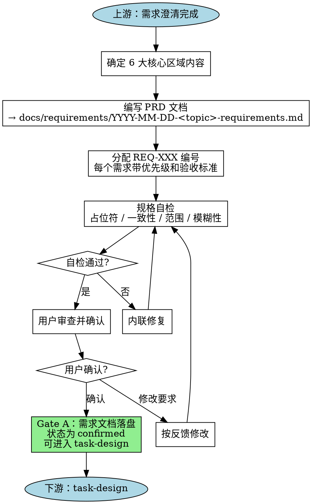

# 需求规格驱动开发

## 概述

需求规格驱动开发（Spec-Driven Development）要求在编写任何代码之前，先产出一份正式的需求规格文档（PRD）。这份文档不是一次性产物，而是在整个开发周期中持续更新的**活文档**——它随着你对问题的理解加深而演进，但始终是后续所有阶段的唯一事实源。

**核心原则：** 把模糊的"需求"重构为可验证的**成功标准**。不是"用户能登录"，而是"用户输入正确凭证后，2 秒内返回 JWT Token 并重定向到首页"。

**上游：** Jarvis 阶段 1A 需求澄清——与用户对齐目标、范围、约束后，用本技能将设计结论固化为 PRD。
**下游：** Jarvis 阶段 2 任务分解（`task-design`）——PRD 确认后，进入 Gate A，通过后进入任务分解。

## 何时使用

**始终使用：**

- 新项目启动
- 新功能开发
- 重大重构或架构变更
- 跨子系统变更

**可以不使用：**

- 纯配置变更（如修改 `.eslintrc`）
- 简单 Bug 修复（改一行、改一个条件）
- 文档或注释更新
- 依赖版本升级（无行为变更）

> 犹豫时，偏向使用。一份两行的规格也比没有规格强。

## 何时不使用

以下情形跳过本技能，直接采用更轻量的方式：

| 情形                         | 替代方案                                     |
| ---------------------------- | -------------------------------------------- |
| 改动范围明确、影响仅限单文件 | 直接在需求文档中写入简要目标，标注为轻量 PRD |
| 用户已提供完整的验收标准     | 确认后直接进入 Gate A                        |
| 探索性原型                   | 跳过，但原型落地前必须补规格                 |

## 流程



**终止状态是 Gate A 通过，进入 task-design。** 不要在 PRD 尚未确认前进入任务分解或实现阶段。

## 详细步骤

### 步骤 1：确定 6 大核心区域

在落笔之前，先对以下 6 个维度有清晰答案：

| 区域                          | 要回答的问题                                 | 示例                                                          |
| ----------------------------- | -------------------------------------------- | ------------------------------------------------------------- |
| **目标（Objective）**         | 为什么要做？解决什么问题？谁会用？           | "让运营人员无需开发介入即可配置促销规则"                      |
| **命令/接口（Commands/API）** | 用户或外部系统如何触发行为？输入输出是什么？ | `POST /api/promotions` → `{ id, rules, status }`              |
| **项目结构（Structure）**     | 文件如何组织？模块边界在哪？共享区域有哪些？ | `src/promotions/` 下按 `routes/`, `services/`, `models/` 分层 |
| **代码风格（Style）**         | 命名约定、错误处理模式、日志规范             | 统一用 `Result<T, E>` 做返回值，Controller 层不写业务逻辑     |
| **测试策略（Testing）**       | 测什么？怎么测？覆盖率目标？                 | TDD，单元测试覆盖核心业务，集成测试覆盖 API 契约              |
| **边界（Boundaries）**        | 做什么、不做什么？与哪些系统交互？           | 范围内：CRUD 促销规则；范围外：A/B 测试、效果分析             |

### 步骤 2：编写 PRD 文档

将 6 大核心区域的内容写入文档，保存到：

```
docs/requirements/YYYY-MM-DD-<topic>-requirements.md
```

> 文档写作应遵循 `chinese-documentation` 技能中的排版规范（中英文空格、全角标点、术语处理等）。

### 步骤 3：分配 REQ-XXX 编号

将每条需求分配唯一编号，格式为 `REQ-XXX`（如 `REQ-001`、`REQ-002`），每个 REQ 必须包含：

- **优先级：** P0（阻塞）/ P1（必须）/ P2（应该）/ P3（可选）
- **验收标准：** 可验证的、无歧义的条件
- **关联模块：** 该 REQ 涉及的文件或模块

编号贯穿全程——从 PRD → `task-design` 的 `TASK-XXX` → `planner` 的 Execution Packet → `qa-review-expert` 的追踪矩阵，形成完整的可追溯链。

### 步骤 4：规格自检

编写完成 PRD 后，以全新视角审视文档：

1. **占位符扫描：** 有没有"待定"、"TODO"、未决定的具体值？要么定下来，要么标注风险。
2. **内部一致性：** 目标、接口、边界之间有矛盾吗？REQ-001 说"支持批量导入"，但接口设计只有单条创建？
3. **范围检查：** 这份规格能用一个实现计划覆盖吗？如果需要进一步拆分，在进入 task-design 前拆分。
4. **模糊性检查：** 有没有需求可以被两种方式理解？"用户上传的文件需要验证"——验证什么？大小？类型？内容？

发现问题后直接**内联修复**，无需重新审查——修好继续推进。

### 步骤 5：用户审查关卡

规格自检完成后，请用户审查：

> "需求文档已落盘到 `docs/requirements/YYYY-MM-DD-<topic>-requirements.md`，包含 N 条 REQ。请审查一下，在进入任务分解前如有修改请告知。"

等待用户回复。修改后重新执行规格自检。只有在用户确认后，才视为 **Gate A 通过**。

### 步骤 6：过渡到任务分解

Gate A 通过后（即 jarvis.md 中定义的需求文档确认状态），由 Jarvis 调用 `task-design` 进入任务分解与规划阶段。不要调用任何实现技能——`task-design` 是唯一的下一步。

## 活文档原则

PRD 不是写完就锁死的合同。在开发过程中，遇到以下情形时**主动更新** PRD：

- 实现时发现遗漏的需求 → 补充 REQ，标注变更原因
- 用户提出新约束 → 追加 REQ，重新评估优先级
- 技术调研推翻假设 → 更新接口/结构部分，标注影响范围

每次更新后，在文档顶部的变更日志区域记录：

```markdown
### 变更日志

| 日期       | 变更内容                         | 影响 REQ         | 原因                   |
| ---------- | -------------------------------- | ---------------- | ---------------------- |
| 2026-04-29 | 新增 REQ-007：支持促销规则草稿态 | REQ-001, REQ-003 | 用户反馈需要预发布能力 |
```

## 常见合理化借口

| 合理化借口                       | 现实                                                           |
| -------------------------------- | -------------------------------------------------------------- |
| "这个太简单了，不需要规格"       | 简单任务不需要长规格，但仍需验收标准。两行规格也比没有好。     |
| "我先写代码，后补规格"           | 那是文档，不是规格。规格的价值在于编码前强制澄清。             |
| "规格会拖慢速度"                 | 15 分钟写规格，省下数小时返工。                                |
| "需求反正会变"                   | 所以规格是活文档。过期的规格也比没有规格强。                   |
| "用户知道他们要什么"             | 即使最清晰的请求也有隐含假设。规格暴露这些假设。               |
| "我们敏捷，不写文档"             | 敏捷重可工作软件，但不拒绝澄清需求。PRD 正是澄清工具。         |
| "头脑风暴时已经讨论清楚了"       | 口头共识不是可追溯的事实源。写下来才算对齐。                   |
| "只需一个任务，直接写 plan 就好" | 即便如此，plan 的"目标"段落就是简化版规格。用 REQ 编号标注它。 |

## 红线

以下信号意味着你在跳过规格驱动，**必须停下来**：

- 没有 REQ 编号就开始写 `TASK-XXX`
- 需求文档中有"待定"但未标注风险和决策截止时间
- 用聊天记录替代落盘的 PRD 文件
- Gate A 未通过就调用 `task-design` 或实现代理
- "需求很简单，我口头确认一下就行"
- PRD 中缺少任何一条 REQ 的验收标准
- 范围边界中写到"根据后续情况再定"——切割范围的决策必须现在做出

## 验证清单

在将需求文档标记为 `confirmed` 并进入 Gate A 之前，逐项检查：

### 内容完整

- [ ] 6 大核心区域（目标/命令/结构/风格/测试/边界）均已覆盖
- [ ] 每条需求有 `REQ-XXX` 编号
- [ ] 每条需求有优先级（P0/P1/P2/P3）
- [ ] 每条需求有可验证的验收标准
- [ ] 范围内和范围外明确列出
- [ ] 风险与开放问题已记录

### 质量

- [ ] 无"待定"、"TODO"或未决定的占位符
- [ ] 所有验收标准可客观验证（不是"体验好"而是"3 秒内加载完成"）
- [ ] 接口定义包含输入、输出、错误场景
- [ ] 章节之间无矛盾（目标 ↔ 接口 ↔ 边界一致）
- [ ] 范围适合单人/单团队的实现计划覆盖

### 排版

- [ ] 遵循 `chinese-documentation` 排版规范（中英空格、全角标点等）
- [ ] 文档落盘到 `docs/requirements/YYYY-MM-DD-<topic>-requirements.md`
- [ ] 变更日志已初始化

### 流程

- [ ] 上游需求澄清已完成
- [ ] 规格自检已执行，问题已修复
- [ ] 用户已审查并确认
- [ ] 准备通过 Gate A 进入 task-design

---

**下一步：** Jarvis 调用 `task-design` 进入任务分解阶段。
