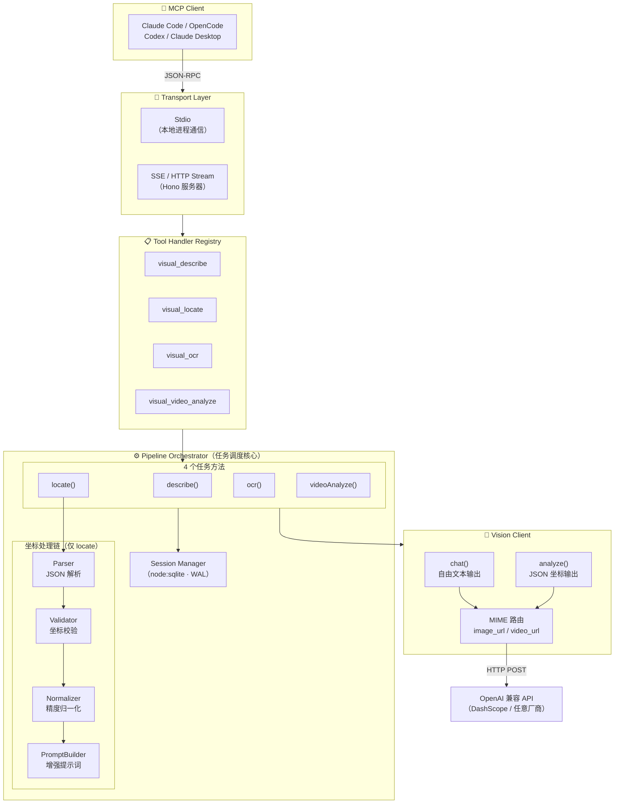

# Visual Primitives MCP

[](https://www.npmjs.com/package/visual-primitives-mcp)
[](https://www.npmjs.com/package/visual-primitives-mcp)
[](./LICENSE)

> **灵感来源**：[DeepSeek《Thinking with Visual Primitives》](https://github.com/mitkox/Thinking-with-Visual-Primitives)（2026 年 4 月 30 日发布）首次提出将**边界框和点坐标作为最小思维单元**直接嵌入推理轨迹。本 MCP 服务器将该范式封装为标准 MCP 工具，并引入**任务调度**架构——先描述后定位，两阶段各司其职。

基于视觉原语范式的多模态视觉理解 MCP 服务器。通过任务调度机制，将场景理解和坐标定位分离为独立工具，实现「先看清 → 再定位」的精确空间推理。

## 核心能力

- **任务调度**：4 个专注工具各司其职——描述、定位、OCR、视频分析
- **两阶段推理**：`visual_describe` 先理解场景 → `visual_locate` 再精确坐标定位
- **多模态统一管道**：图片/视频/文档统一转为 Base64 图像列表，复用同一分析管道
- **有状态多轮会话**：基于 SQLite 持久化，跨轮复用已标注物体，0 额外视觉成本
- **降级兜底**：任何阶段异常均生成降级结果，不中断服务

## 快速开始（零安装）

**MCP 客户端配置后自动安装，无需手动 `npm install`。** `npx` 在首次运行时自动从 npm 拉取最新版到临时缓存。

1. 在项目根目录创建/编辑 `.mcp.json`，填入配置（见下方）
2. 重启 Claude Code
3. 完——npx 自动下载并启动，零手动操作

> 想全局安装也可以：`npm install -g visual-primitives-mcp`

## 前置要求

- Node.js >= 22.5.0（`node:sqlite` 内置模块要求）
- 视觉模型 API Key（推荐 [阿里云百炼平台](https://dashscope.aliyuncs.com/)）

## 推荐视觉模型

| 模型             | 平台       | API URL                                             | 特点                                     |
| ---------------- | ---------- | --------------------------------------------------- | ---------------------------------------- |
| **qwen3.5-plus** | 阿里云百炼 | `https://dashscope.aliyuncs.com/compatible-mode/v1` | 视觉能力强、性价比高、与 OpenAI 接口兼容 |

## MCP 客户端配置

配置完成后无需手动启动服务——MCP 客户端会自动拉起进程，stdio 模式零端口占用。

### Claude Code（推荐）

在项目根目录的 `.mcp.json` 中添加，Claude Code 自动发现并启动：

```json
{
  "mcpServers": {
    "visual-primitives": {
      "type": "stdio",
      "command": "npx",
      "args": ["visual-primitives-mcp"],
      "env": {
        "VISION_API_BASE_URL": "https://dashscope.aliyuncs.com/compatible-mode/v1",
        "VISION_API_KEY": "你的百炼 API Key",
        "VISION_MODEL_NAME": "qwen3.5-plus",
        "VISION_DESCRIBE_MODEL": "qwen3-vl-plus",
        "VISION_LOCATE_MODEL": "qwen3-vl-plus",
        "VISION_OCR_MODEL": "qwen3-vl-ocr",
        "VISION_VIDEO_MODEL": "qwen3-vl-plus"
      }
    }
  }
}
```

如果是本地源码开发，用 `node` 直接启动：

```json
{
  "mcpServers": {
    "visual-primitives": {
      "type": "stdio",
      "command": "node",
      "args": ["dist/server.js"],
      "env": {
        "VISION_API_BASE_URL": "https://dashscope.aliyuncs.com/compatible-mode/v1",
        "VISION_API_KEY": "你的百炼 API Key",
        "VISION_MODEL_NAME": "qwen3.5-plus",
        "VISION_DESCRIBE_MODEL": "qwen3-vl-plus",
        "VISION_LOCATE_MODEL": "qwen3-vl-plus",
        "VISION_OCR_MODEL": "qwen3-vl-ocr",
        "VISION_VIDEO_MODEL": "qwen3-vl-plus"
      }
    }
  }
}
```

### Claude Desktop

编辑 `claude_desktop_config.json`：

```json
{
  "mcpServers": {
    "visual-primitives": {
      "command": "npx",
      "args": ["visual-primitives-mcp"],
      "env": {
        "VISION_API_BASE_URL": "https://dashscope.aliyuncs.com/compatible-mode/v1",
        "VISION_API_KEY": "你的百炼 API Key",
        "VISION_MODEL_NAME": "qwen3.5-plus",
        "VISION_DESCRIBE_MODEL": "qwen3-vl-plus",
        "VISION_LOCATE_MODEL": "qwen3-vl-plus",
        "VISION_OCR_MODEL": "qwen3-vl-ocr",
        "VISION_VIDEO_MODEL": "qwen3-vl-plus"
      }
    }
  }
}
```

### OpenCode

编辑 `opencode.json`（项目根目录或 `~/.config/opencode/opencode.json`）：

```json
{
  "mcp": {
    "visual-primitives": {
      "type": "local",
      "command": ["npx", "visual-primitives-mcp"],
      "environment": {
        "VISION_API_BASE_URL": "https://dashscope.aliyuncs.com/compatible-mode/v1",
        "VISION_API_KEY": "你的百炼 API Key",
        "VISION_MODEL_NAME": "qwen3.5-plus",
        "VISION_DESCRIBE_MODEL": "qwen3-vl-plus",
        "VISION_LOCATE_MODEL": "qwen3-vl-plus",
        "VISION_OCR_MODEL": "qwen3-vl-ocr",
        "VISION_VIDEO_MODEL": "qwen3-vl-plus"
      },
      "enabled": true
    }
  }
}
```

### Codex

编辑 `~/.codex/config.toml` 或项目根目录 `.codex.toml`：

```toml
[mcp_servers.visual-primitives]
command = "npx"
args = ["visual-primitives-mcp"]

[mcp_servers.visual-primitives.env]
VISION_API_BASE_URL = "https://dashscope.aliyuncs.com/compatible-mode/v1"
VISION_API_KEY = "你的百炼 API Key"
VISION_MODEL_NAME = "qwen3.5-plus"
VISION_DESCRIBE_MODEL = "qwen3-vl-plus"
VISION_LOCATE_MODEL = "qwen3-vl-plus"
VISION_OCR_MODEL = "qwen3-vl-ocr"
VISION_VIDEO_MODEL = "qwen3-vl-plus"
```

## 环境变量配置

如果从源码运行，复制 `.env.example` 为 `.env` 并填写必填项：

```bash
cp .env.example .env
```

| 变量名                     | 说明                                      | 默认值                | 必填 |
| -------------------------- | ----------------------------------------- | --------------------- | ---- |
| 变量名                     | 说明                                      | 默认值                | 必填 |
| ----------------------     | ----------------------------------------- | --------------------- | ---- |
| `VISION_API_BASE_URL`      | 视觉模型 API 基础 URL                     | —                     | 是   |
| `VISION_API_KEY`           | API 密钥                                  | —                     | 是   |
| `VISION_MODEL_NAME`        | 模型名称                                  | —                     | 是   |
| `VISION_DESCRIBE_BASE_URL` | describe 专用 baseUrl（不配回退默认值）   | —                     | 否   |
| `VISION_DESCRIBE_API_KEY`  | describe 专用 apiKey（不配回退默认值）    | —                     | 否   |
| `VISION_DESCRIBE_MODEL`    | describe 专用 model（不配回退默认值）     | —                     | 否   |
| `VISION_LOCATE_BASE_URL`   | locate 专用 baseUrl（不配回退默认值）     | —                     | 否   |
| `VISION_LOCATE_API_KEY`    | locate 专用 apiKey（不配回退默认值）      | —                     | 否   |
| `VISION_LOCATE_MODEL`      | locate 专用 model（不配回退默认值）       | —                     | 否   |
| `VISION_OCR_BASE_URL`      | OCR 专用 baseUrl（不配回退默认值）        | —                     | 否   |
| `VISION_OCR_API_KEY`       | OCR 专用 apiKey（不配回退默认值）         | —                     | 否   |
| `VISION_OCR_MODEL`         | OCR 专用 model（不配回退默认值）          | —                     | 否   |
| `VISION_VIDEO_BASE_URL`    | video 专用 baseUrl（不配回退默认值）      | —                     | 否   |
| `VISION_VIDEO_API_KEY`     | video 专用 apiKey（不配回退默认值）       | —                     | 否   |
| `VISION_VIDEO_MODEL`       | video 专用 model（不配回退默认值）        | —                     | 否   |
| `COORDINATE_PRECISION`     | 坐标归一化精度（`0-100` 或 `0-1000`）     | `0-1000`              | 否   |
| `MCP_TRANSPORT`            | 传输协议（`stdio`/`sse`/`http-stream`）   | `stdio`               | 否   |
| `LOG_LEVEL`                | 日志级别（`debug`/`info`/`warn`/`error`） | `info`                | 否   |
| `TIMEOUT_MS`               | API 调用超时（毫秒）                      | `45000`               | 否   |
| `SESSION_TTL_SECONDS`      | 会话过期时间（秒）                        | `3600`                | 否   |
| `DB_PATH`                  | SQLite 数据库文件路径                     | `./data/grounding.db` | 否   |
| `PORT`                     | SSE/HTTP Stream 模式端口                  | `3000`                | 否   |

## 启动方式

### Stdio 模式（推荐）

```bash
npm start
# 或
npx visual-primitives-mcp
```

### SSE 模式（HTTP 服务）

```bash
MCP_TRANSPORT=sse PORT=3000 npm start
```

健康检查端点：`GET http://localhost:3000/health`

### HTTP Stream 模式

```bash
MCP_TRANSPORT=http-stream PORT=3000 npm start
```

## MCP 工具

### 新工具（推荐）

| 工具                       | 用途               | 关键参数                                                          |
| -------------------------- | ------------------ | ----------------------------------------------------------------- |
| **`visual_describe`**      | 场景描述（第一步） | `image_path`, `prompt?`, `session_id?`                            |
| **`visual_locate`**        | 坐标定位（第二步） | `question`, `image_path?`, `session_id?`, `coordinate_precision?` |
| **`visual_ocr`**           | 文字/表格提取      | `image_path`, `prompt?`                                           |
| **`visual_video_analyze`** | 视频内容分析       | `video_path`, `prompt?`, `session_id?`                            |

### `visual_describe` — 场景描述

对图片/截图进行场景描述 + 关键物体识别。**支持多轮对话**：传入 `session_id` 可复用之前的描述上下文，实现追问式交互。

| 参数         | 类型   | 必填 | 说明                      |
| ------------ | ------ | ---- | ------------------------- |
| `image_path` | string | 是   | 本地图片绝对路径          |
| `prompt`     | string | 否   | 分析指令，默认全面描述    |
| `session_id` | string | 否   | 会话 ID，首次不传自动生成 |

**输出 JSON Schema**：

```jsonc
{
  "session_id": "uuid",           // 会话 ID（跨轮复用）
  "description": "自然语言描述",    // 画面内容、布局、颜色、物体关系
  "round": 1,                     // 会话轮次
  "objects": [                    // 识别到的关键物体列表
    {
      "id": 1,                    // 物体唯一 ID
      "label": "物体名称",         // 简洁标签
      "bbox": [x1, y1, x2, y2],   // 边界框（左上角原点，0-1000 归一化）
      "centroid": [cx, cy],       // 中心点坐标
      "color": "颜色名称",         // 显著颜色特征（可选）
      "state": "正常",            // 状态（可选）
      "relevance": "高",          // 相关度（可选）
      "position_hint": "右下区域，偏右385偏下140"
        // ↑ 以画面中心(500,500)为原点换算的自然语言方位
        // "画面中心" | "左上区域" | "右下区域，偏右X偏下Y"
    }
  ]
}
```

**坐标体系**：统一左上角原点 `(0,0)`，归一化到 `0-1000`。`position_hint` 是自动换算的辅助字段，不改变坐标协议，仅为 LLM 推理提供直观方位参考。

### `visual_locate` — 坐标定位

基于场景上下文，精确定位目标物体的坐标。配合 `visual_describe` 使用，定位更准确。

| 参数                   | 类型   | 必填 | 说明                                       |
| ---------------------- | ------ | ---- | ------------------------------------------ |
| `question`             | string | 是   | 定位目标，如"找到蓝色提交按钮"             |
| `image_path`           | string | 否   | 本地图片路径，不传则使用缓存场景信息       |
| `session_id`           | string | 否   | 会话 ID，首次不传自动生成                  |
| `coordinate_precision` | string | 否   | 坐标精度 `0-100` / `0-1000`，默认 `0-1000` |

**返回值**：

```json
{
  "session_id": "uuid-string",
  "raw_visual_analysis": {
    "objects": [
      {
        "id": 1,
        "label": "提交按钮",
        "bbox": [850, 620, 920, 660],
        "centroid": [885, 640]
      }
    ],
    "spatial_relationships": []
  },
  "augmented_prompt": "[多模态空间信息]\n- (id:1) \"提交按钮\" bbox[850,620,920,660]...",
  "objects_count": 1,
  "from_cache": false,
  "round": 2
}
```

### `visual_ocr` — 文字识别

从图片中提取文字和表格内容。

| 参数         | 类型   | 必填 | 说明                                 |
| ------------ | ------ | ---- | ------------------------------------ |
| `image_path` | string | 是   | 本地图片绝对路径                     |
| `prompt`     | string | 否   | 处理指令，如"只提取表格""翻译为英文" |

**返回值**：直接返回识别出的文字内容。

### `visual_video_analyze` — 视频分析

分析视频内容，返回视频摘要描述。**支持多轮对话**：传入 `session_id` 可基于之前的分析结果进行追问。

| 参数         | 类型   | 必填 | 说明                      |
| ------------ | ------ | ---- | ------------------------- |
| `video_path` | string | 是   | 本地视频绝对路径          |
| `prompt`     | string | 否   | 分析指令，默认全面描述    |
| `session_id` | string | 否   | 会话 ID，首次不传自动生成 |

**返回值**：

```json
{
  "session_id": "uuid-string",
  "description": "视频展示了...",
  "round": 1
}
```

## 推荐使用流程

**两步法（先描述 + 后定位）**：

```json
// 第一步：理解场景
// visual_describe(image_path="E:/screenshots/page.png")
{
  "session_id": "abc123",
  "description": "页面包含顶部导航栏（Logo、搜索框、用户头像）、左侧菜单栏（5个菜单项）、主内容区（数据表格、分页器）、右下角蓝色「新建」按钮...",
  "round": 1
}

// 第二步：精确定位
// visual_locate(session_id="abc123", question="找到蓝色新建按钮的坐标")
{
  "session_id": "abc123",
  "raw_visual_analysis": {
    "objects": [{"id": 1, "label": "新建按钮", "bbox": [850,620,920,660], "centroid": [885,640]}]
  },
  "from_cache": false,
  "round": 2
}
```

## 支持的输入格式

| 格式 | 扩展名          | 大小限制 | 说明                             |
| ---- | --------------- | -------- | -------------------------------- |
| JPEG | `.jpg`, `.jpeg` | <= 20MB  | 直接传本地路径                   |
| PNG  | `.png`          | <= 20MB  | 直接传本地路径                   |
| GIF  | `.gif`          | <= 20MB  | 直接传本地路径                   |
| WebP | `.webp`         | <= 20MB  | 直接传本地路径                   |
| BMP  | `.bmp`          | <= 20MB  | 直接传本地路径                   |
| MP4  | `.mp4`          | <= 100MB | 直接发送 video_url，模型原生理解 |
| MOV  | `.mov`          | <= 100MB | 同上                             |
| AVI  | `.avi`          | <= 100MB | 同上                             |
| MKV  | `.mkv`          | <= 100MB | 同上                             |
| WebM | `.webm`         | <= 100MB | 同上                             |

## 开发指南

```bash
# 开发模式（热重载）
npm run dev

# 代码检查
npm run lint
npm run format:check

# 类型检查
npm run typecheck

# 运行测试
npm test

# 测试覆盖率
npm run test:coverage

# 构建
npm run build
```

## 项目结构

```
visual-primitives-mcp/
├── AGENTS.md                       # 完整架构文档
├── CLAUDE.md                       # 项目入口指引
├── src/
│   ├── CLAUDE.md                   # 入口层指引
│   ├── server.ts                   # MCP 服务入口
│   ├── config.ts                   # 配置读取与校验
│   ├── types.ts                    # 共享类型定义
│   ├── transport/
│   │   ├── CLAUDE.md               # 传输层指引
│   │   └── factory.ts              # 传输工厂
│   ├── handlers/
│   │   ├── CLAUDE.md               # 处理器层指引
│   │   └── tool-handlers.ts        # MCP 工具注册（4 个工具）
│   ├── core/
│   │   ├── CLAUDE.md               # 核心管道层指引
│   │   ├── pipeline.ts             # 管道编排器（任务调度）
│   │   ├── parser.ts               # JSON 解析与容错
│   │   ├── validator.ts            # 坐标与物体验证
│   │   ├── normalizer.ts           # 坐标归一化
│   │   ├── prompt-builder.ts       # 增强提示词构建器
│   │   ├── vision-client.ts        # OpenAI 兼容视觉客户端
│   │   ├── session-manager.ts      # SQLite 会话管理
│   │   └── sqlite-wrapper.ts       # node:sqlite Vite 兼容适配
│   ├── templates/
│   │   ├── describe-system.txt     # 场景描述系统提示词
│   │   ├── locate-system.txt       # 坐标定位系统提示词
│   │   └── ocr-system.txt          # OCR 系统提示词
│   └── utils/
│       ├── CLAUDE.md               # 工具层指引
│       ├── logger.ts               # 结构化日志
│       └── retry.ts                # 指数退避重试
├── tests/
│   └── CLAUDE.md                   # 测试套件指引
├── bin/
│   └── cli.js                      # CLI 入口
├── data/                           # SQLite 数据库文件（相对于 CWD）
└── package.json
```

## 数据库与会话隔离

> **推荐：每个项目独立数据库（默认行为）。** 视觉分析会话与项目上下文强绑定——项目 A 的 UI 截图和项目 B 无关，共享只会引入噪音。

SQLite 数据库默认路径为 **`./data/grounding.db`**（相对于 MCP 服务启动目录）。MCP 客户端（Claude Code 等）在每个项目根目录启动服务进程，因此不同项目天然隔离。

如果确有跨项目共享需求（如持续分析同一个应用的多仓库），设置绝对路径：`DB_PATH=/home/xxx/shared-vision.db`。

**会话 TTL**：默认 3600 秒（1 小时）未访问的会话自动清理。可通过 `SESSION_TTL_SECONDS` 调整。

**跨工具共享**：同一 `session_id` 下的所有工具共享上下文（物体坐标 + 对话历史），跨轮跨工具追问零 API 成本。

## 架构

完整架构文档、数据流、设计决策见 **[AGENTS.md](./AGENTS.md)**。各层级指引见各级 `CLAUDE.md`。



## 技术栈

- **运行时**：Node.js >= 22.5.0
- **语言**：TypeScript (strict)
- **MCP 协议**：@modelcontextprotocol/sdk
- **HTTP 传输**：Hono（SSE/HTTP Stream 模式）
- **参数校验**：Zod
- **日志**：pino
- **持久化**：node:sqlite（内置，WAL 模式）
- **测试**：vitest

## License

MIT
